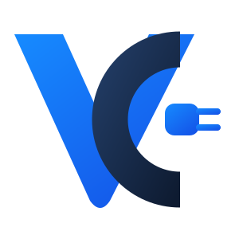

  

  <strong>⚡ Free. 🔌 Self-hosted. 🧠 OCPP. 💙 Community.</strong>

  <a href="README.md">🇩🇪 Deutsch</a> · <a href="README.en.md">🇬🇧 English</a>

---

> [!WARNING]
> ## ⚠️⚡ COMMUNITY ESCALATION
> **VoltCore Community is FREE. Really free. 🆓💸**
>
> No trial timer. ⏳❌ No “three users only”. 👥❌ No “one charge point and then pay”. 🔌💳❌ No intentionally crippled demo mode. 🪚😵
>
> The Community Edition is meant to be a **genuinely useful, self-hosted OCPP platform** you can actually run. 🖥️⚡🔋

## 🆓 Free. 🖥️ Self-hosted. ✅ Actually useful.

VoltCore Community is the **free Community edition of VoltCore** for self-hosted OCPP charging management. ⚡🔌

The idea is simple: people, clubs, organisations, small fleets, labs and curious nerds 🤓 should be able to operate their own charging infrastructure with a solid VoltCore base **without paying for the Community edition**.

### 💸 Price: **0. Free. Kostenlos. Gratis.**

Community is not intended to be annoying or deliberately crippled. The difference to future VoltCore editions should come from advanced product features, analytics, integrations and enterprise capabilities — **not** from breaking the basics. 🧠✨

> 🚧 **Status:** work in progress. Not yet intended for public production use.

## 🚀 Installation

VoltCore Community supports two official deployment methods:

- 🐳 **Docker Compose** — our default route
- 🟦 **Portainer** — convenient stack deployment through the GUI

👉 **[Open the full installation guide](docs/INSTALLATION.en.md)**

It covers requirements, startup, ports, persistent data, updates, backup notes and troubleshooting step by step. 📚🔧

## ⚡ Planned Community scope

The first Community edition is planned to include:

- 🔌 OCPP 1.6J
- 🛰️ charge point discovery and onboarding
- 🔋 connector status
- 📡 live charge point status
- ▶️⏹️ start / stop of charging sessions
- 🎛️ basic remote commands
- 🪪 RFID management
- 👤 user management
- 🚗 basic vehicle management
- 🧾 charging session history
- 🔗 basic user / vehicle / RFID assignment
- 📊 dashboard
- 🖥️ basic LiveView
- 📈 basic reports
- 📄 CSV export
- 💾 backup / restore
- 🔄 in-app update menu
- 🌙 dark mode
- 🎨 basic branding such as organisation name and logo
- 🛡️ security baseline
- 🔐 roles: Administrator / User / Read-only
- 🩺 system status
- 🧭 basic logs / audit
- 🔔 basic notifications
- 📱 PWA baseline

The fixed initial scope is documented in `docs/COMMUNITY_SCOPE.md`. 📋✅

## 🔄 Updates via GitHub

VoltCore Community keeps the familiar **Update** menu inside the application. 🧰⚡

Stable Community releases will be published as **GitHub Releases** in this repository. Running installations can check GitHub for newer stable versions and notify administrators directly inside VoltCore. 🚀

Planned behaviour:

- 🚦 automatic update check after backend startup
- 🕒 periodic checks in the background
- 🔍 manual **Check for updates** action
- 📝 release notes before installation
- 🧪 validation that the release belongs to VoltCore Community
- 🗃️ database migration awareness
- 🛟 backup and rollback safety

Public Community releases are designed to be discoverable **without requiring every installation to store its own GitHub access token**. 🔓🐙

> 🧩 **Important:** GitHub Releases are the fixed update source for the Community Edition. The actual installation method intentionally stays deployment-neutral. Docker, Portainer or other deployment variants may provide their own installer later — **VoltCore Community itself is not tied to Portainer.**

## 🌍 Languages

VoltCore Community is **multilingual by design**. 🌐✨

Initial languages:

- 🇩🇪 German
- 🇬🇧 English

Browser language detection is supported. A manual language choice can override automatic detection. English is the fallback language. 🔁

Translation files live in `app/locales/` and the application uses translation keys instead of hard-coded interface text wherever practical. 🧩

## 🎨 Branding & logo set

The official Community branding is included directly in the project. 💙⚡

  

Included assets:

- 🖼️ horizontal primary logo
- 🌙 dark-surface logo
- ↕️ stacked logo
- 🔌 transparent VC icon
- 📱 app icon
- ⭐ favicon

Files live under `app/static/branding/`. Details and palette information are documented in `docs/BRANDING.md`.

## 🧑‍💻 Development model

VoltCore Community is derived from the private VoltCore development baseline. 🧠⚙️

Non-Community features are removed from the Community source rather than merely hidden. This helps ensure the future public repository does not accidentally contain code that does not belong to Community. 🧹🔒

Branches:

- 🟢 `main` — future stable Community releases
- 🟡 `develop` — Community integration branch
- 🔵 short-lived feature branches — isolated work before integration

The repository remains private while the first Community build is prepared and verified. 🔐🚧

## 🧾 What “free” means here

VoltCore Community is intended to be the **free VoltCore edition**. 🆓💙

The final public software license has not yet been selected. That decision will be made before this repository is public. Until then, this private development repository is not a final licensing statement. ⚖️

That distinction is intentional:

- 🆓 **Community edition: free**
- 📜 **final public license: still to be selected**
- 🔐 **repository visibility: private until Community is release-ready**

## 📚 Documentation

Current project documentation:

- 📋 Community scope: `docs/COMMUNITY_SCOPE.md`
- 🌍 Internationalisation: `docs/I18N.md`
- 🎨 Branding & logo set: `docs/BRANDING.md`
- 🐳🟦 Installation: `docs/INSTALLATION.en.md`

More detailed installation, configuration, update, backup, OCPP, security and troubleshooting documentation will be added as the Community build matures. 🛠️📖

## 💙 Philosophy

VoltCore Community should be:

- ✅ useful instead of artificially limited
- 🧠 understandable instead of mysterious
- 🔄 updateable instead of disposable
- 🖥️ self-hostable instead of cloud-dependent
- 🛡️ secure by default
- ✨ pleasant to use
- 🤓 nerdy enough to still feel like VoltCore ⚡

---

  <strong>⚡ VoltCore Community — OCPP charging management. 🆓 Free. 🖥️ Self-hosted. 💙 Community-focused.</strong>

  And yes: this README is absolutely allowed to escalate further. 😂🔥📚⚡

